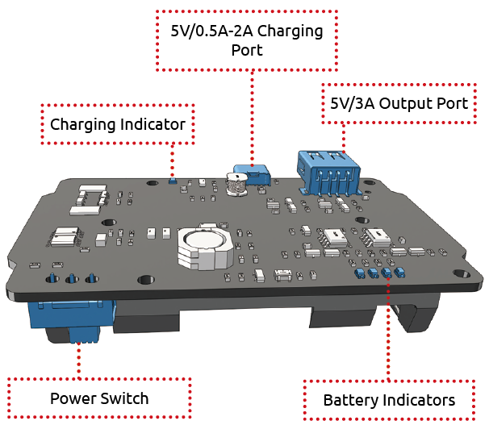
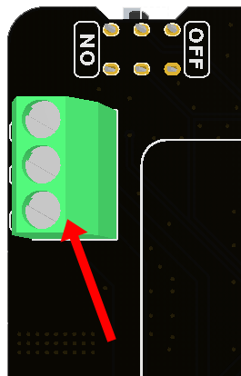
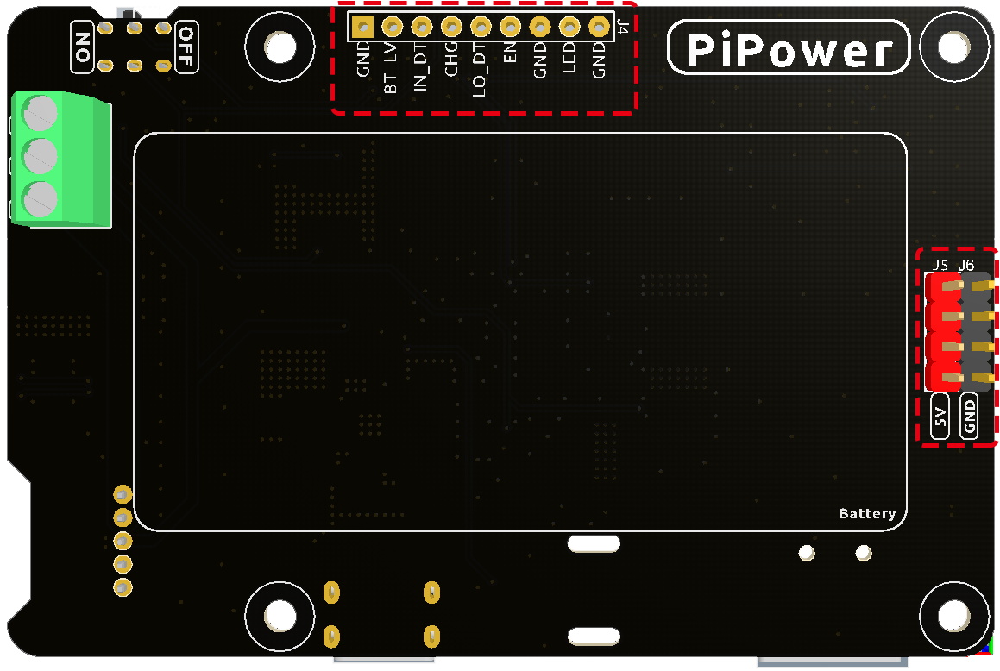
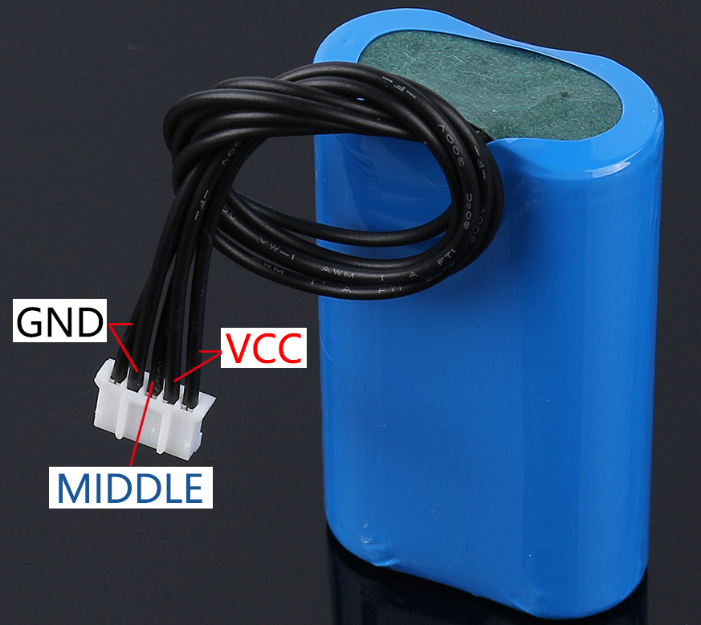

.. note::

    Hallo und willkommen in der SunFounder Raspberry Pi & Arduino & ESP32 Enthusiasten-Gemeinschaft auf Facebook! Tauchen Sie tiefer ein in die Welt von Raspberry Pi, Arduino und ESP32 mit anderen Enthusiasten.

    **Warum beitreten?**

    - **Expertenunterstützung**: Lösen Sie Nachverkaufsprobleme und technische Herausforderungen mit Hilfe unserer Gemeinschaft und unseres Teams.
    - **Lernen & Teilen**: Tauschen Sie Tipps und Anleitungen aus, um Ihre Fähigkeiten zu verbessern.
    - **Exklusive Vorschauen**: Erhalten Sie frühzeitigen Zugang zu neuen Produktankündigungen und exklusiven Einblicken.
    - **Spezialrabatte**: Genießen Sie exklusive Rabatte auf unsere neuesten Produkte.
    - **Festliche Aktionen und Gewinnspiele**: Nehmen Sie an Gewinnspielen und Feiertagsaktionen teil.

    👉 Sind Sie bereit, mit uns zu erkunden und zu erschaffen? Klicken Sie auf [|link_sf_facebook|] und treten Sie heute bei!

Eigenschaften
===============

* Durchgangsladung
* Abschaltstrom: < 0,5mA
* Eingang:
    * USB Typ-C, 5V/3A
    * Batterieeingang
* Ausgang:
    * USB Typ-A, 5V/3A
    * 2x4P P2.54 Pin-Header

* Ladeleistung: 7,4V/1A 7,4W
* Integrierter Akku
    * Typ: 3,7V Lithium-Ionen-Batterien x 2
    * Kapazität: 2000mAh
    * Anschluss: PH2.0, 5P
* Unterspannungsschutz: 3,2V
* Überladeschutz: 4,2V
* Abmessungen: 90mm x 60mm x 24,9mm
* Anzeigen auf der Platine
    * 1 x Ladeanzeige (CHG)
    * 1 x Betriebsanzeige (PWR)
    * 4 Batterieanzeigen (D4 ~ D7)

Laden und Entladen
------------------------------------

**Strompfadwechsel**

Das PiPower V2 verfügt über eine integrierte Stromversorgungsfunktion, die automatisch den Strompfad umschaltet, um den Batterieverbrauch zu minimieren.

* Bei angeschlossenem externen Netzteil wird die 5V-Ausgabe direkt vom Netzteil bereitgestellt. Dabei lässt sich der Strompfad über den Schalter aktivieren oder deaktivieren. Zusätzlich kann das Netzteil den Akku bei geringem Strombedarf aufladen.
* Wird das externe Netzteil entfernt, schaltet PiPower nahtlos auf die Akku-Stromversorgung um, um das Gerät zu schützen.

**Ladeleistung**

Je nach Stellung des Stromschalters wird die Ladeleistung angepasst.

* Ist der Stromschalter aus, versorgt PiPower keine externen Geräte mit Energie. In diesem Zustand beträgt die Ladeleistung 7W, und es dauert etwa 2 Stunden, um von 0% auf 100% zu laden.
* Bei aktiviertem Stromschalter wird das angeschlossene Gerät direkt vom externen Netzteil versorgt. Die Ladeleistung wird dann auf unter 1W reduziert, um die Stromversorgung sicherzustellen.

**Unterspannungsschutz**

Fällt die Spannung einer Einzelbatterie unter 3,2V, wird der Batterieschutz aktiviert und die Entladung der Batterie gestoppt.

Sollte die Batterie entfernt werden, aktiviert der an Bord befindliche Unterspannungsschutz, da die Spannung als zu niedrig erachtet wird. Nach dem Wiederanschluss der Batterie muss das Typ-C-Kabel in die Ladebuchse eingesteckt werden, um den Schutzmechanismus zu deaktivieren. Anschließend ist der Akku wieder normal nutzbar.

**Überladeschutz**

Der Ladevorgang endet, sobald die Gesamtspannung der Batterie 8,4V erreicht.

**Ladeausgleich**

Übersteigt die Spannung eines einzelnen Akkus 4,2V, tritt der Spannungsteiler in Aktion und der Ladestrom der Batterie wird reduziert oder sogar unterbrochen.

**Temperatur**

Bei Erreichen der maximalen Ausgangsleistung von 5V/3A steigt die Temperatur des DC-DC-Buck-Chips U1 auf etwa 70-80 Grad Celsius. Vorsicht beim Berühren, um Verbrennungen zu vermeiden. Sollte die Temperatur den DC-DC-Schutzwert von 75 Grad Celsius erreichen, wird der DC-DC-Converter abgeschaltet, um Überhitzung zu vermeiden.

Batterieanzeigen
--------------------------

Die Beziehung zwischen den Batterieanzeigen und der Spannung ist wie folgt:

* 4 LEDs alle an: Spannung > 7,8V
* 3 LEDs an: Spannung > 7,36V
* 2 LEDs an: Spannung >6,96V
* 1 LED an: Spannung > 6,6V
* 4 LEDs alle aus: Spannung <6,6V – in diesem Zustand sollten die Batterien geladen werden.

Externe Batterie
--------------------------

Sie können Ihre eigene Batterie über den Schraubanschluss anschließen.

.. warning:: Schließen Sie nicht gleichzeitig die externe Batterie und die im Lieferumfang enthaltene Batterie an!

Die externe Batterie unterstützt nur zwei in Reihe geschaltete 3,7V Lithium-Batterien. Das Interface hat drei Pins: "+", "M" und "-". Diese sollten entsprechend mit dem positiven Anschluss der Batterie, der Mitte der beiden Batterien und dem negativen Anschluss der Batterie verbunden werden.

Das PiPower-Board verfügt über einen integrierten Batterieschutzschaltkreis, der Schutz vor Tiefentladung, Überladung und Überstrom bietet. Daher wird empfohlen, keine Batterien mit eigenen Schutzplatinen zu verwenden.

Das 'M'-Interface dient hauptsächlich dem Schutzschaltkreis des Boards für den Schutz von Einzelzellen und ausbalancierten Ladevorgängen. Wenn Sie Schutz- und Ausgleichsladefunktionen nicht benötigen, können Sie den Anschluss an das 'M'-Interface weglassen.

.. image:: img/ex_btr.png

Über IO-Pins
-----------------

Um den DIY-Anforderungen der Kunden gerecht zu werden, sind auf dem PiPower mehrere Signaleingänge vorhanden, diese sind jedoch standardmäßig nicht gelötet.

* **GND**: Erdungseingang
* **BT_LV**: Pin zur Abfrage der Batteriespannung. Die Spannung dieses Pins entspricht 1/3 der Batteriespannung.
* **IN_DT**: Eingangserkennungspin. Wird verwendet, um zu bestimmen, ob eine USB-Stromversorgung vorhanden ist. Ist dies der Fall, gibt dieser Pin ein Hochsignal aus.
* **CHG**: Ladezustandsanzeigepin. Dieser Pin ist während des Ladevorgangs hoch.
* **LO_DT**: Pin für niedrigen Batteriezustand. Im Normalzustand ist dieser Pin niedrig. Bei Erkennung einer niedrigen Batteriespannung wird dieser Pin hoch.
* **EN**: Schaltersignaleingang. Der EN-Pin kann mit einem externen Schalter verbunden werden. Wird dieser Pin auf den Boden gelegt, ist das PiPower ausgeschaltet. Der externe Schalter darf kein selbstzurücksetzender Button oder Schlüssel sein. Der EN-Pin ist nur wirksam, wenn der integrierte Schalter eingeschaltet ist.
* **GND**: Erdungseingang
* **LED**: Anzeige für Stromversorgung. Gibt 5V bei eingeschaltetem Strom aus. Beim Anschluss einer externen LED muss ein Strombegrenzungswiderstand eingefügt werden.
* **GND**: Erdungseingang

Über die Batterie
----------------------

* **VCC**: Positiver Batterieanschluss, hier gibt es zwei Sätze von VCC und GND, um den Strom zu erhöhen und den Widerstand zu verringern.
* **Middle**: Um die Spannung zwischen den beiden Zellen auszugleichen und die Batterie zu schützen.
* **GND**: Negativer Batterieanschluss.

Dies ist ein kundenspezifisches Batteriepaket von SunFounder, bestehend aus zwei 3,7V 18650 Batterien mit einer Kapazität von 2200mAh. Der Anschluss ist PH2.0-5P, welcher direkt in das PiPower eingesteckt und geladen werden kann.

