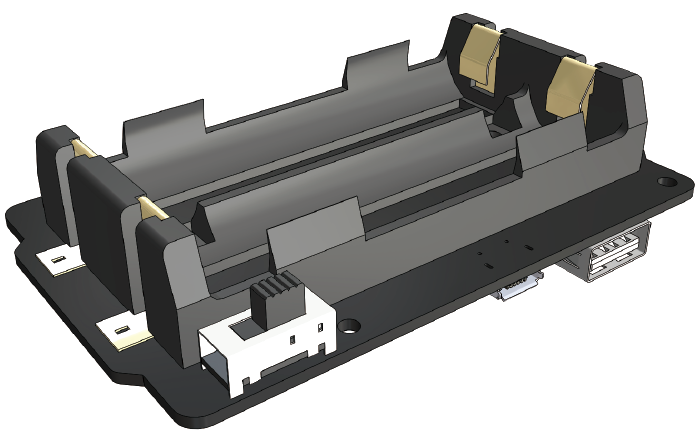

.. note::

    こんにちは、SunFounderのRaspberry Pi & Arduino & ESP32愛好家コミュニティへようこそ！Facebook上でRaspberry Pi、Arduino、ESP32についてもっと深く掘り下げ、他の愛好家と交流しましょう。

    **参加する理由は？**

    - **エキスパートサポート**：コミュニティやチームの助けを借りて、販売後の問題や技術的な課題を解決します。
    - **学び＆共有**：ヒントやチュートリアルを交換してスキルを向上させましょう。
    - **独占的なプレビュー**：新製品の発表や先行プレビューに早期アクセスしましょう。
    - **特別割引**：最新製品の独占割引をお楽しみください。
    - **祭りのプロモーションとギフト**：ギフトや祝日のプロモーションに参加しましょう。

    👉 私たちと一緒に探索し、創造する準備はできていますか？[|link_sf_facebook|]をクリックして今すぐ参加しましょう！

|link_PiPower| - Raspberry Pi用のUPSバッテリー
=============================================

* |link_Pi_Power|

SunFounder |link_PiPower|をお選びいただき、ありがとうございます。

.. note::
    このドキュメントは以下の言語で利用可能です。

        * |link_german_tutorials|
        * |link_jp_tutorials|
        * |link_en_tutorials|

    ご希望の言語でドキュメントにアクセスするために、それぞれのリンクをクリックしてください。

**UPSが何をするのか？**

Raspberry Piプロジェクトで安定した電力供給が必要な場合、主電源だけに頼るのはリスキーです。地域によっては、電力の落ちや急激な電圧変動が頻繁に発生し、数時間続くこともあります。このような電力の不安定性はRaspberry Piに損傷を与える可能性があり、停電が発生すると即座にシャットダウンします。その結果、安全なシャットダウンができず、SDカード上のデータが全て失われ、壊れる可能性が高まります。

そのため、無停電電源装置（UPS）の使用が推奨されます。

UPSを利用すれば、主電源からの供給が途絶えた場合（停電など）、バッテリーや他の電源が代わりになり、デバイスをシャットダウンすることなく継続して動作させます。UPSは一般に非常用電源とされています。主電源が復旧した後、UPSは再び充電して次の非常事態に備えます。

**PiPowerについて**

このような背景から、PiPowerは最初から設計されました。PiPowerはRaspberry Piのセカンダリ電源として使用できます。USB-Cの主電源アダプタをPiPowerに接続すると、Raspberry Piは直接電源供給を受け、同時に低電流でバッテリーも充電されます。PiPowerは、停電やUSB-C主電源の切断が発生した際にも、Raspberry Piに途切れることなく電力を供給します。

PiPowerは、5V/3Aの電源を出力でき、様々なRaspberry Piの使用状況に対応します。
電源インジケーターが4つあり、各インジケーターは電力の25%を表示します。また、電源コードを抜き差しすることなくRaspberry Piの電源をオン/オフできる電源スイッチも装備しています。

.. warning::
    バッテリーを初めて装着する場合や、バッテリーを外して再度装着した場合、正常に動作しない可能性があります。このような場合、Type Cケーブルを充電ポートに接続して保護回路を解除し、バッテリーを正常に使用できるようにしてください。

.. toctree::
    components
    assemble
    features
    safe_shutdown
    faq
