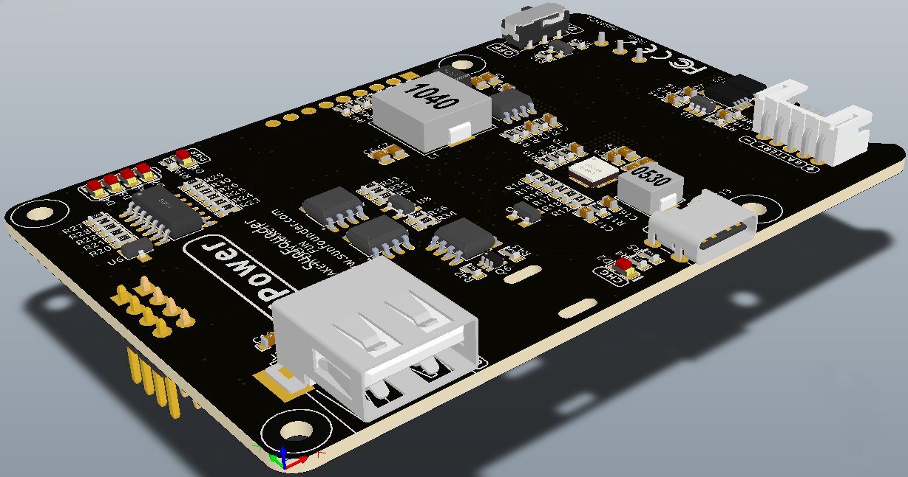

.. note::

    Hallo und willkommen in der SunFounder Raspberry Pi & Arduino & ESP32 Enthusiasten-Gemeinschaft auf Facebook! Tauchen Sie tiefer ein in die Welt von Raspberry Pi, Arduino und ESP32 mit anderen Enthusiasten.

    **Warum beitreten?**

    - **Expertenunterstützung**: Lösen Sie Nachverkaufsprobleme und technische Herausforderungen mit Hilfe unserer Gemeinschaft und unseres Teams.
    - **Lernen & Teilen**: Tauschen Sie Tipps und Anleitungen aus, um Ihre Fähigkeiten zu verbessern.
    - **Exklusive Vorschauen**: Erhalten Sie frühzeitigen Zugang zu neuen Produktankündigungen und exklusiven Einblicken.
    - **Spezialrabatte**: Genießen Sie exklusive Rabatte auf unsere neuesten Produkte.
    - **Festliche Aktionen und Gewinnspiele**: Nehmen Sie an Gewinnspielen und Feiertagsaktionen teil.

    👉 Sind Sie bereit, mit uns zu erkunden und zu erschaffen? Klicken Sie auf [|link_sf_facebook|] und treten Sie heute bei!

|link_PiPower| - Raspberry Pi USV mit Batterie
=============================================

* |link_Pi_Power|

Danke, dass Sie sich für unser |link_PiPower| entschieden haben.

.. note::
    Dieses Dokument ist in den folgenden Sprachen verfügbar.

        * |link_german_tutorials|
        * |link_jp_tutorials|
        * |link_en_tutorials|
    
    Bitte klicken Sie auf die jeweiligen Links, um das Dokument in Ihrer bevorzugten Sprache aufzurufen.

**Was macht eine USV?**

Wenn Ihr Raspberry Pi-Projekt eine konstante Stromversorgung benötigt, ist das alleinige Verlassen auf das Hauptstromsystem keine tragfähige Lösung. Je nach Standort können Stromausfälle und -spitzen häufig auftreten und oft mehrere Stunden andauern. Jede Stromschwankung kann Ihren Raspberry Pi beschädigen und ein Stromausfall wird ihn sofort herunterfahren. Dies führt dazu, dass er nicht sicher heruntergefahren wird, was den Verlust aller Daten auf der SD-Karte zur Folge haben kann und die Wahrscheinlichkeit erhöht, dass sie zerstört wird.

Daher wird die Verwendung einer unterbrechungsfreien Stromversorgung (USV) empfohlen.

Mit einer USV, wenn es zu einem Stromausfall aus dem Netz kommt, übernimmt die Batterie oder eine andere Stromquelle und versorgt das Gerät weiterhin ohne es herunterzufahren. Eine USV wird oft als Notstromquelle betrachtet. Nach der Reparatur der Hauptstromquelle wird die USV wieder aufgeladen und ist bereit, den nächsten Ausfall zu bewältigen.

**Über PiPower**

Genau aus diesem Grund haben wir PiPower entwickelt. PiPower kann als zweite Stromquelle für den Raspberry Pi verwendet werden. Ein USB-C-Netzteil, das an den PiPower angeschlossen ist, versorgt den Raspberry Pi direkt und lädt die Batterie mit geringem Strom auf. PiPower kann einen Raspberry Pi bei einem Stromausfall oder beim Trennen des USB-C-Netzstroms nahtlos mit Strom versorgen.

PiPower bietet eine 5V/3A Stromversorgung, um verschiedenen Einsatzszenarien des Raspberry Pi gerecht zu werden.
Es verfügt über 4 Ladeanzeigen; jede Anzeige steht für 25% der Energie und ist mit einem Ein-/Ausschalter ausgestattet, um den Raspberry Pi ein- oder auszuschalten, ohne das Netzkabel zu stecken oder zu ziehen.

.. warning::
    Wenn Sie den Akku zum ersten Mal einsetzen oder wenn er entfernt und erneut eingesetzt wird, funktioniert der Akku nicht ordnungsgemäß. In diesem Fall müssen Sie das Typ-C-Kabel in den Ladeanschluss stecken, um den Schutzschaltkreis auszuschalten, und der Akku kann normal verwendet werden.

.. toctree::
    components
    assemble
    features
    safe_shutdown
    faq
